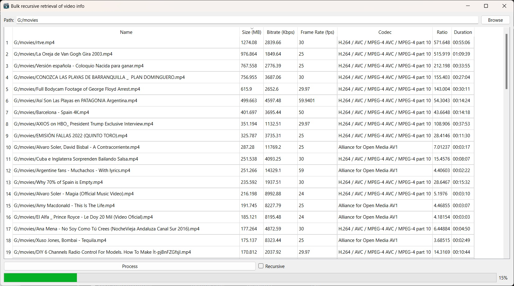

# Bulk recursive retrieval of video info
This program was developed utilizing the Qt framework to recursively retrieve information about all video files located within a designated directory

**Please note that you need to prepare FFmpeg static libraries yourself, or if you want to compile it with shared FFmpeg libraries, you should remove the following lines in BatchVideoInfoApp.pro because they are just necessary for static linking:**

```
-llibavdevice \
-llibavutil \
-llibavfilter \
-llibswscale \
-llibswresample \
-lSecur32 \
-lBcrypt \
-lMfplat \
-lMfuuid \
-lstrmiids
```

**And regardless of which compilation method you use, you must re-specify the correct paths to the FFmpeg header files and libraries in BatchVideoInfoApp.pro.**

## Screenshots


